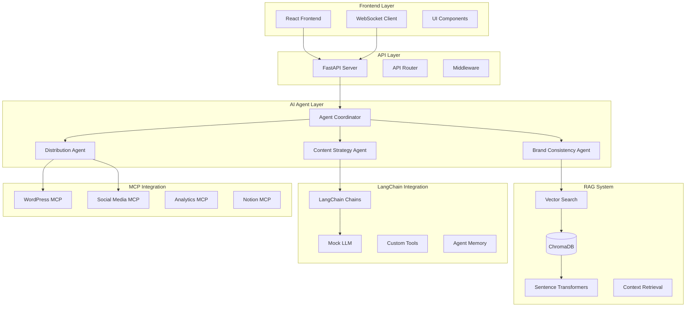

# Content Creation Assistant - System Architecture

## 🏗️ Overview

The Content Creation Assistant is a sophisticated AI-powered system that demonstrates modern AI architecture patterns using **LangChain**, **RAG (Retrieval-Augmented Generation)**, and **MCP (Model Context Protocol)** integrations. The system showcases real-world implementation of multi-agent coordination, vector-based semantic search, and external platform integration.

## 🎯 Architecture Goals

- **Demonstrate AI Agent Orchestration**: Show how LangChain agents coordinate to solve complex content creation tasks
- **Showcase RAG Implementation**: Implement semantic search with context injection for enhanced content generation
- **Exhibit Real-time AI Reasoning**: Provide transparent view into AI decision-making processes
- **Display External Integration**: Connect to multiple platforms via standardized MCP protocol
- **Production-Ready Patterns**: Use scalable, maintainable architecture suitable for enterprise deployment

## 🔄 System Architecture Diagram



## 🤖 AI Agent Architecture

### Agent Hierarchy and Coordination

Our multi-agent system uses **LangChain** to implement a hierarchical agent structure:

```python
# Agent Coordinator - Master orchestrator
class AgentCoordinator:
    def __init__(self):
        self.content_strategy_agent = ContentStrategyAgent()
        self.brand_consistency_agent = BrandConsistencyAgent()
        self.distribution_agent = DistributionAgent()
        self.rag_chain = EcoTechRAGChain()
    
    async def orchestrate_content_creation(self, request: GenerationRequest):
        """
        Coordinates multiple agents to create optimized content
        """
        # Step 1: Strategy Planning
        strategy = await self.content_strategy_agent.plan_content_strategy(request)
        
        # Step 2: RAG Context Retrieval
        context = await self.rag_chain.retrieve_relevant_context(
            query=request.prompt,
            content_type=request.content_type
        )
        
        # Step 3: Content Generation
        content = await self.content_strategy_agent.generate_content(
            strategy=strategy,
            context=context,
            request=request
        )
        
        # Step 4: Brand Voice Analysis
        brand_analysis = await self.brand_consistency_agent.analyze_brand_voice(
            content=content,
            target_score=0.8
        )
        
        # Step 5: Distribution Planning
        distribution_plan = await self.distribution_agent.plan_distribution(
            content=content,
            platforms=request.platforms
        )
        
        return ContentGenerationResponse(
            content=content,
            reasoning=self._build_reasoning_chain(strategy, brand_analysis),
            confidence=brand_analysis.confidence,
            brand_voice_score=brand_analysis.score,
            distribution_plan=distribution_plan
        )
```

### Individual Agent Responsibilities

#### 1. Content Strategy Agent
**Purpose**: Plans content approach and generates core content

```python
class ContentStrategyAgent:
    def __init__(self):
        self.llm = MockOpenAILLM()
        self.strategy_chain = LLMChain(
            llm=self.llm,
            prompt=self._build_strategy_prompt()
        )
        self.generation_chain = LLMChain(
            llm=self.llm,
            prompt=self._build_generation_prompt()
        )
    
    async def plan_content_strategy(self, request: GenerationRequest):
        """Analyzes request and creates content strategy"""
        strategy_input = {
            "prompt": request.prompt,
            "content_type": request.content_type,
            "target_audience": request.target_audience,
            "tone": request.tone
        }
        
        strategy = await self.strategy_chain.arun(**strategy_input)
        
        return ContentStrategy(
            approach=strategy.approach,
            key_points=strategy.key_points,
            structure=strategy.structure,
            reasoning=strategy.reasoning
        )
    
    async def generate_content(self, strategy, context, request):
        """Generates content based on strategy and RAG context"""
        generation_input = {
            "strategy": strategy,
            "context": context,
            "prompt": request.prompt,
            "max_length": request.max_length
        }
        
        content = await self.generation_chain.arun(**generation_input)
        return content
```

#### 2. Brand Consistency Agent
**Purpose**: Ensures content aligns with brand voice and style

```python
class BrandConsistencyAgent:
    def __init__(self):
        self.vector_db = ChromaVectorDB()
        self.embedding_model = SentenceTransformer('all-MiniLM-L6-v2')
        self.brand_analysis_chain = LLMChain(
            llm=MockOpenAILLM(),
            prompt=self._build_brand_analysis_prompt()
        )
    
    async def analyze_brand_voice(self, content: str, target_score: float = 0.8):
        """Analyzes content for brand voice consistency"""
        
        # 1. Find similar brand voice examples via vector search
        similar_content = await self.vector_db.similarity_search(
            query=content,
            collection_name="brand_voice_examples",
            k=5
        )
        
        # 2. Analyze consistency using LangChain
        analysis_input = {
            "content": content,
            "similar_examples": similar_content,
            "target_score": target_score
        }
        
        analysis = await self.brand_analysis_chain.arun(**analysis_input)
        
        return BrandVoiceAnalysis(
            score=analysis.score,
            confidence=analysis.confidence,
            characteristics=analysis.characteristics,
            suggestions=analysis.suggestions,
            similar_examples=similar_content
        )
```

#### 3. Distribution Agent
**Purpose**: Manages multi-platform publishing via MCP

```python
class DistributionAgent:
    def __init__(self):
        self.mcp_clients = {
            'wordpress': WordPressMCPClient(),
            'linkedin': SocialMediaMCPClient(),
            'twitter': SocialMediaMCPClient(),
            'notion': NotionMCPClient()
        }
        self.distribution_chain = LLMChain(
            llm=MockOpenAILLM(),
            prompt=self._build_distribution_prompt()
        )
    
    async def plan_distribution(self, content: str, platforms: List[str]):
        """Creates platform-specific distribution strategy"""
        
        distribution_plan = await self.distribution_chain.arun(
            content=content,
            platforms=platforms
        )
        
        return DistributionPlan(
            platforms=platforms,
            adaptations=distribution_plan.adaptations,
            scheduling=distribution_plan.scheduling,
            optimizations=distribution_plan.optimizations
        )
    
    async def execute_distribution(self, content: ContentItem, platforms: List[str]):
        """Executes multi-platform publishing via MCP"""
        
        results = []
        for platform in platforms:
            if platform in self.mcp_clients:
                try:
                    result = await self.mcp_clients[platform].publish_content(content)
                    results.append(PublishResult(
                        platform=platform,
                        success=True,
                        result=result
                    ))
                except Exception as e:
                    results.append(PublishResult(
                        platform=platform,
                        success=False,
                        error=str(e)
                    ))
        
        return results
```

## 🔍 RAG (Retrieval-Augmented Generation) Implementation

### Vector Database Architecture

Our RAG system uses **ChromaDB** with **sentence-transformers** for local embedding generation:

```python
class ChromaVectorDB:
    def __init__(self):
        self.client = chromadb.PersistentClient(path="./data/chroma_db")
        self.embedding_model = SentenceTransformer('all-MiniLM-L6-v2')
        self.collections = {}
    
    def initialize_collection(self, collection_name: str, metadata_schema: dict):
        """Initialize a collection with specific schema"""
        collection = self.client.get_or_create_collection(
            name=collection_name,
            metadata={"schema": metadata_schema}
        )
        self.collections[collection_name] = collection
        return collection
    
    async def add_content_items(self, items: List[ContentItem], collection_name: str):
        """Add content items with embeddings to the vector database"""
        
        # Generate embeddings locally
        texts = [item.content for item in items]
        embeddings = self.embedding_model.encode(texts)
        
        # Prepare data for ChromaDB
        ids = [item.id for item in items]
        documents = texts
        metadatas = [item.metadata for item in items]
        
        # Store in ChromaDB
        collection = self.collections[collection_name]
        collection.add(
            embeddings=embeddings.tolist(),
            documents=documents,
            metadatas=metadatas,
            ids=ids
        )
    
    async def similarity_search(
        self, 
        query: str, 
        collection_name: str,
        k: int = 5,
        similarity_threshold: float = 0.7
    ):
        """Perform semantic similarity search"""
        
        # Generate query embedding
        query_embedding = self.embedding_model.encode([query])
        
        # Search in ChromaDB
        collection = self.collections[collection_name]
        results = collection.query(
            query_embeddings=query_embedding.tolist(),
            n_results=k,
            include=['documents', 'metadatas', 'distances']
        )
        
        # Filter by similarity threshold and format results
        search_results = []
        for i, distance in enumerate(results['distances'][0]):
            similarity_score = 1 - distance  # Convert distance to similarity
            
            if similarity_score >= similarity_threshold:
                search_results.append(SearchResult(
                    id=results['ids'][0][i],
                    content=results['documents'][0][i],
                    metadata=results['metadatas'][0][i],
                    similarity_score=similarity_score,
                    relevance_explanation=self._generate_relevance_explanation(
                        query, results['documents'][0][i], similarity_score
                    )
                ))
        
        return search_results
```

### RAG Chain Implementation

Our RAG chain integrates retrieval with generation using LangChain:

```python
class EcoTechRAGChain:
    def __init__(self):
        self.vector_db = ChromaVectorDB()
        self.llm = MockOpenAILLM()
        self.retrieval_qa_chain = RetrievalQA.from_chain_type(
            llm=self.llm,
            chain_type="stuff",
            retriever=self._create_retriever(),
            return_source_documents=True
        )
    
    def _create_retriever(self):
        """Create a custom retriever that uses our vector database"""
        return ChromaRetriever(
            vector_db=self.vector_db,
            collection_name="ecotech_content"
        )
    
    async def generate_with_context(
        self, 
        query: str, 
        content_type: str,
        max_context_items: int = 5
    ):
        """Generate content using retrieved context"""
        
        # Step 1: Retrieve relevant context
        relevant_docs = await self.vector_db.similarity_search(
            query=query,
            collection_name="ecotech_content",
            k=max_context_items,
            similarity_threshold=0.7
        )
        
        # Step 2: Format context for the prompt
        context = self._format_context_for_prompt(relevant_docs)
        
        # Step 3: Build enhanced prompt with context
        enhanced_prompt = self._build_context_aware_prompt(
            query=query,
            context=context,
            content_type=content_type
        )
        
        # Step 4: Generate content using LangChain
        result = await self.retrieval_qa_chain.arun(
            query=enhanced_prompt,
            return_source_documents=True
        )
        
        return RAGGenerationResult(
            content=result['result'],
            source_documents=relevant_docs,
            context_used=context,
            retrieval_metadata={
                'query': query,
                'documents_retrieved': len(relevant_docs),
                'total_context_length': len(context)
            }
        )
    
    def _format_context_for_prompt(self, documents: List[SearchResult]) -> str:
        """Format retrieved documents into context string"""
        context_parts = []
        
        for i, doc in enumerate(documents, 1):
            context_parts.append(f"""
Context {i} (Similarity: {doc.similarity_score:.2f}):
Title: {doc.metadata.get('title', 'Untitled')}
Content: {doc.content[:500]}...
Relevance: {doc.relevance_explanation}
""")
        
        return "\n".join(context_parts)
    
    def _build_context_aware_prompt(self, query: str, context: str, content_type: str) -> str:
        """Build a prompt that incorporates retrieved context"""
        return f"""
You are an expert content creator specializing in sustainable technology and eco-friendly solutions.

User Request: {query}
Content Type: {content_type}

Relevant Context from Knowledge Base:
{context}

Instructions:
1. Use the provided context to inform your response
2. Maintain consistency with the established brand voice shown in the context
3. Include specific details and examples from the context where relevant
4. Generate content that builds upon the existing knowledge base
5. Ensure the content is accurate and aligns with sustainable technology principles

Generate high-quality {content_type} content that addresses the user's request while incorporating insights from the retrieved context.
"""
```

### Vector Search and Similarity Scoring

The system implements sophisticated similarity scoring with explanations:

```python
class SimilarityScorer:
    def __init__(self):
        self.embedding_model = SentenceTransformer('all-MiniLM-L6-v2')
        self.llm = MockOpenAILLM()
    
    def calculate_semantic_similarity(self, text1: str, text2: str) -> float:
        """Calculate semantic similarity between two texts"""
        embeddings = self.embedding_model.encode([text1, text2])
        
        # Calculate cosine similarity
        similarity = cosine_similarity([embeddings[0]], [embeddings[1]])[0][0]
        return float(similarity)
    
    async def generate_relevance_explanation(
        self, 
        query: str, 
        document: str, 
        similarity_score: float
    ) -> str:
        """Generate explanation for why a document is relevant"""
        
        explanation_prompt = f"""
Explain why this document is relevant to the user's query.

Query: {query}
Document: {document[:300]}...
Similarity Score: {similarity_score:.3f}

Provide a concise explanation of the relevance focusing on:
1. Key concepts that match
2. Specific information that addresses the query
3. How this content could be useful for the user's needs
"""
        
        explanation = await self.llm.agenerate([explanation_prompt])
        return explanation.generations[0][0].text.strip()
```

## 🔗 Model Context Protocol (MCP) Integration

### MCP Architecture

Our MCP implementation provides standardized communication with external platforms:

```python
class MCPClient:
    """Base class for Model Context Protocol clients"""
    
    def __init__(self, platform: str, host: str, port: int):
        self.platform = platform
        self.host = host
        self.port = port
        self.session = aiohttp.ClientSession()
    
    async def send_mcp_message(self, message: MCPMessage) -> MCPResponse:
        """Send MCP message to external platform"""
        
        url = f"http://{self.host}:{self.port}/mcp"
        
        async with self.session.post(url, json=message.dict()) as response:
            if response.status == 200:
                data = await response.json()
                return MCPResponse(**data)
            else:
                raise MCPError(f"MCP request failed: {response.status}")
    
    async def authenticate(self, credentials: dict) -> bool:
        """Authenticate with the external platform"""
        
        auth_message = MCPMessage(
            id=str(uuid.uuid4()),
            method=f"{self.platform}.authenticate",
            params=credentials
        )
        
        response = await self.send_mcp_message(auth_message)
        return response.result.get("authenticated", False)

class WordPressMCPClient(MCPClient):
    """WordPress-specific MCP client implementation"""
    
    def __init__(self):
        super().__init__("wordpress", "localhost", 8001)
    
    async def create_post(self, content: ContentItem) -> MCPResponse:
        """Create a new WordPress post"""
        
        message = MCPMessage(
            id=str(uuid.uuid4()),
            method="wordpress.create_post",
            params={
                "title": content.title,
                "content": content.content,
                "status": "publish",
                "categories": content.metadata.get("categories", []),
                "tags": content.metadata.get("tags", [])
            }
        )
        
        return await self.send_mcp_message(message)
    
    async def get_posts(self, limit: int = 10) -> List[dict]:
        """Retrieve posts from WordPress"""
        
        message = MCPMessage(
            id=str(uuid.uuid4()),
            method="wordpress.get_posts",
            params={"limit": limit}
        )
        
        response = await self.send_mcp_message(message)
        return response.result.get("posts", [])

class SocialMediaMCPClient(MCPClient):
    """Social media platforms MCP client"""
    
    def __init__(self):
        super().__init__("social_media", "localhost", 8002)
    
    async def post_to_linkedin(self, content: ContentItem) -> MCPResponse:
        """Post content to LinkedIn"""
        
        message = MCPMessage(
            id=str(uuid.uuid4()),
            method="social_media.linkedin.post",
            params={
                "text": content.content,
                "visibility": "PUBLIC"
            }
        )
        
        return await self.send_mcp_message(message)
    
    async def post_to_twitter(self, content: ContentItem) -> MCPResponse:
        """Post content to Twitter"""
        
        # Truncate content for Twitter's character limit
        tweet_text = content.content[:280]
        
        message = MCPMessage(
            id=str(uuid.uuid4()),
            method="social_media.twitter.post",
            params={"text": tweet_text}
        )
        
        return await self.send_mcp_message(message)
```

### Mock MCP Servers

For demonstration purposes, we implement realistic mock servers that simulate external platform behavior:

```python
class MockMCPServer:
    """Mock MCP server that simulates external platform responses"""
    
    def __init__(self, platform: str, port: int):
        self.platform = platform
        self.port = port
        self.app = FastAPI()
        self.setup_routes()
    
    def setup_routes(self):
        @self.app.post("/mcp")
        async def handle_mcp_request(message: MCPMessage):
            """Handle incoming MCP requests"""
            
            # Simulate processing time
            await asyncio.sleep(random.uniform(0.5, 2.0))
            
            # Route to appropriate handler
            method_parts = message.method.split('.')
            platform = method_parts[0]
            action = '.'.join(method_parts[1:])
            
            if platform == self.platform:
                handler = getattr(self, f"handle_{action.replace('.', '_')}", None)
                if handler:
                    result = await handler(message.params)
                    return MCPResponse(
                        id=message.id,
                        result=result
                    )
            
            # Default error response
            return MCPResponse(
                id=message.id,
                error={
                    "code": -32601,
                    "message": f"Method not found: {message.method}"
                }
            )
    
    async def handle_create_post(self, params: dict):
        """Mock WordPress post creation"""
        
        # Simulate random success/failure
        if random.random() < 0.1:  # 10% failure rate
            raise HTTPException(
                status_code=500,
                detail="Simulated platform error"
            )
        
        post_id = f"wp_{int(time.time())}"
        return {
            "post_id": post_id,
            "url": f"https://example-blog.com/posts/{post_id}",
            "status": "published",
            "created_at": datetime.utcnow().isoformat()
        }
```

## 🚀 Real-time Communication Architecture

### WebSocket Implementation

Real-time agent activity streaming uses WebSocket connections:

```python
class WebSocketManager:
    def __init__(self):
        self.active_connections: List[WebSocket] = []
    
    async def connect(self, websocket: WebSocket):
        await websocket.accept()
        self.active_connections.append(websocket)
    
    def disconnect(self, websocket: WebSocket):
        self.active_connections.remove(websocket)
    
    async def broadcast_agent_activity(self, activity: AgentActivity):
        """Broadcast agent activity to all connected clients"""
        
        message = {
            "type": "agent_activity",
            "timestamp": datetime.utcnow().isoformat(),
            "activity": activity.dict()
        }
        
        # Send to all connected clients
        for connection in self.active_connections:
            try:
                await connection.send_json(message)
            except ConnectionClosedOK:
                self.disconnect(connection)

# WebSocket endpoint for real-time agent monitoring
@app.websocket("/ws/generation")
async def websocket_generation_endpoint(websocket: WebSocket):
    await websocket_manager.connect(websocket)
    
    try:
        while True:
            # Receive generation requests
            data = await websocket.receive_json()
            
            if data.get("type") == "generate_content":
                request = GenerationRequest(**data["request"])
                
                # Stream agent activity during generation
                async for activity in agent_coordinator.stream_generation(request):
                    await websocket.send_json({
                        "type": "agent_step",
                        "activity": activity.dict(),
                        "timestamp": datetime.utcnow().isoformat()
                    })
                
    except WebSocketDisconnect:
        websocket_manager.disconnect(websocket)
```

## 🔧 Data Flow and Processing Pipeline

### Content Generation Pipeline

1. **Request Analysis**: Parse user requirements and determine content strategy
2. **Context Retrieval**: Use RAG to find relevant existing content
3. **Strategy Planning**: LangChain agent plans approach based on context
4. **Content Generation**: Generate content using context-aware prompts
5. **Brand Analysis**: Analyze generated content for brand consistency
6. **Optimization**: Refine content based on analysis results
7. **Distribution Planning**: Plan multi-platform publishing strategy
8. **Execution**: Publish to selected platforms via MCP

### Real-time Monitoring Pipeline

1. **Activity Capture**: Agents emit activity events during processing
2. **Event Streaming**: WebSocket manager broadcasts events to clients
3. **Client Display**: React frontend displays real-time agent reasoning
4. **Progress Tracking**: Visual progress indicators and confidence scores
5. **Error Handling**: Graceful degradation and error recovery

## 📊 Performance and Scalability

### Optimization Strategies

- **Vector Database Indexing**: ChromaDB provides efficient similarity search
- **Embedding Caching**: Pre-computed embeddings stored locally
- **Connection Pooling**: Efficient HTTP client management
- **Async Processing**: Non-blocking operations throughout the pipeline
- **Memory Management**: Efficient handling of large documents and embeddings

### Scalability Considerations

- **Horizontal Scaling**: Multiple FastAPI instances with load balancing
- **Database Sharding**: Vector database can be distributed across nodes
- **Caching Layer**: Redis for frequently accessed content and embeddings
- **Message Queuing**: Async task processing for bulk operations
- **CDN Integration**: Static asset delivery optimization

## 🔒 Security and Privacy

### Security Measures

- **Input Validation**: Comprehensive request validation using Pydantic
- **Rate Limiting**: API throttling to prevent abuse
- **CORS Configuration**: Secure cross-origin resource sharing
- **Environment Variables**: Secure credential management
- **Error Sanitization**: Safe error messages without sensitive data

### Privacy Considerations

- **Local Processing**: Embeddings generated locally, no external API calls
- **Data Minimization**: Only necessary data stored in vector database
- **Retention Policies**: Configurable data retention and cleanup
- **Access Controls**: Role-based access to sensitive operations

## 🧪 Testing and Validation

### Testing Architecture

- **Unit Tests**: Individual component testing with pytest
- **Integration Tests**: End-to-end workflow validation
- **Performance Tests**: Load testing with realistic workloads
- **Mock Testing**: Isolated testing with mock LLM responses
- **WebSocket Testing**: Real-time communication validation

### Quality Assurance

- **Type Safety**: Full TypeScript frontend with Python type hints
- **Code Quality**: Linting, formatting, and static analysis
- **Documentation**: Comprehensive API and architecture documentation
- **Monitoring**: Health checks and performance metrics
- **Error Tracking**: Detailed error logging and analysis

## 🚀 Deployment Architecture

### Container Architecture

- **Multi-stage Builds**: Optimized Docker images for production
- **Health Checks**: Container-level health monitoring
- **Resource Limits**: Memory and CPU constraints for stability
- **Security Scanning**: Vulnerability assessment in CI/CD pipeline

### Infrastructure

- **Railway Deployment**: Cloud-native deployment with auto-scaling
- **Load Balancing**: Traffic distribution across multiple instances
- **Database Persistence**: Persistent volume for vector database
- **Monitoring**: Application and infrastructure monitoring
- **Backup Strategy**: Automated backup and recovery procedures

This architecture demonstrates sophisticated AI system design using modern technologies and best practices, providing a foundation for enterprise-scale content creation and management systems. 