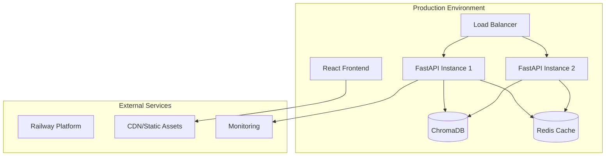

# Content Creation Assistant - Deployment Guide

## 🚀 Deployment Overview

This guide provides comprehensive instructions for deploying the Content Creation Assistant in various environments, from local development to production cloud deployment. The system supports multiple deployment strategies to meet different organizational needs.

## 🏗️ Deployment Architecture



## 📋 Deployment Options

| Option | Complexity | Scalability | Best For |
|--------|------------|-------------|-----------|
| **Railway (Recommended)** | Low | High | Production, quick deployment |
| **Docker Compose** | Medium | Medium | Development, on-premise |
| **Manual Deployment** | High | Medium | Custom environments |
| **Kubernetes** | High | Very High | Enterprise, auto-scaling |

## 🌐 Railway Deployment (Recommended)

Railway provides the simplest path to production deployment with automatic scaling and built-in CI/CD.

### Prerequisites

1. **Railway Account**: Sign up at [railway.app](https://railway.app)
2. **GitHub Repository**: Code hosted on GitHub
3. **Domain Name**: (Optional) Custom domain for production

### Step 1: Project Setup

```bash
# Install Railway CLI
npm install -g @railway/cli

# Login to Railway
railway login

# Initialize project
railway init
```

### Step 2: Configure Environment Variables

Create environment variables in Railway dashboard:

```env
# Backend Configuration
ENVIRONMENT=production
LOG_LEVEL=INFO
PYTHONPATH=/app
PYTHONUNBUFFERED=1

# Database Configuration  
CHROMA_PERSIST_DIRECTORY=/app/data/chroma_db
VECTOR_DB_COLLECTION=ecotech_content

# API Configuration
CORS_ORIGINS=https://your-frontend-domain.railway.app
MAX_CONTENT_LENGTH=2000

# Mock LLM Configuration
MOCK_LLM_RESPONSE_TIME=1.5
MOCK_LLM_ERROR_RATE=0.02

# Frontend Configuration
VITE_API_URL=https://your-backend-domain.railway.app
VITE_WS_URL=wss://your-backend-domain.railway.app
VITE_APP_TITLE=Content Creation Assistant
VITE_APP_VERSION=1.0.0
VITE_ENABLE_ANALYTICS=true
VITE_ENABLE_MCP_INTEGRATIONS=true
```

### Step 3: Deploy Backend

```bash
# Deploy backend service
cd backend
railway up

# Monitor deployment
railway logs

# Check service status
railway status
```

### Step 4: Deploy Frontend

```bash
# Deploy frontend service
cd frontend
railway up

# Set build command
railway run npm run build

# Monitor deployment
railway logs
```

### Step 5: Configure Custom Domain (Optional)

```bash
# Add custom domain
railway domain add your-app.com

# Configure DNS records
# A record: @ -> Railway IP
# CNAME record: www -> your-app.railway.app
```

### Step 6: Production Configuration

```bash
# Set production environment
railway variables set ENVIRONMENT=production

# Configure scaling
railway scale --replicas 2

# Enable monitoring
railway monitoring enable
```

### Railway Deployment Checklist

- [ ] ✅ Backend service deployed and healthy
- [ ] ✅ Frontend service deployed and serving
- [ ] ✅ Environment variables configured
- [ ] ✅ Custom domain configured (if applicable)
- [ ] ✅ SSL certificates enabled
- [ ] ✅ Monitoring and logging enabled
- [ ] ✅ Performance testing completed
- [ ] ✅ Backup strategy implemented

## 🐳 Docker Deployment

Docker deployment provides consistency across environments and simplified orchestration.

### Production Docker Compose

Create `docker-compose.prod.yml`:

```yaml
version: '3.8'

services:
  # Nginx Reverse Proxy
  nginx:
    image: nginx:alpine
    ports:
      - "80:80"
      - "443:443"
    volumes:
      - ./deployment/nginx:/etc/nginx/conf.d
      - ./deployment/ssl:/etc/nginx/ssl
      - nginx_logs:/var/log/nginx
    depends_on:
      - backend
      - frontend
    restart: unless-stopped
    healthcheck:
      test: ["CMD", "curl", "-f", "http://localhost/health"]
      interval: 30s
      timeout: 10s
      retries: 3

  # FastAPI Backend
  backend:
    build:
      context: ./backend
      dockerfile: Dockerfile
      target: production
    environment:
      - ENVIRONMENT=production
      - LOG_LEVEL=INFO
      - PYTHONPATH=/app
      - CHROMA_PERSIST_DIRECTORY=/app/data/chroma_db
    volumes:
      - backend_data:/app/data
      - backend_logs:/app/logs
    restart: unless-stopped
    healthcheck:
      test: ["CMD", "python", "health_check.py"]
      interval: 30s
      timeout: 10s
      retries: 3
      start_period: 60s
    deploy:
      replicas: 2
      resources:
        limits:
          memory: 1G
          cpus: '0.5'
        reservations:
          memory: 512M
          cpus: '0.25'

  # React Frontend
  frontend:
    build:
      context: ./frontend
      dockerfile: Dockerfile
      target: production
      args:
        - VITE_API_URL=https://your-domain.com/api
        - VITE_WS_URL=wss://your-domain.com/ws
    restart: unless-stopped
    healthcheck:
      test: ["CMD", "curl", "-f", "http://localhost/health"]
      interval: 30s
      timeout: 10s
      retries: 3

  # ChromaDB Vector Database
  chroma:
    image: chromadb/chroma:latest
    environment:
      - CHROMA_SERVER_HOST=0.0.0.0
      - CHROMA_SERVER_HTTP_PORT=8000
    volumes:
      - chroma_data:/chroma/chroma
    restart: unless-stopped
    healthcheck:
      test: ["CMD", "curl", "-f", "http://localhost:8000/api/v1/heartbeat"]
      interval: 30s
      timeout: 10s
      retries: 3

  # Redis Cache (Optional)
  redis:
    image: redis:7-alpine
    command: redis-server --appendonly yes
    volumes:
      - redis_data:/data
    restart: unless-stopped
    healthcheck:
      test: ["CMD", "redis-cli", "ping"]
      interval: 30s
      timeout: 10s
      retries: 3

  # Prometheus Monitoring (Optional)
  prometheus:
    image: prom/prometheus:latest
    ports:
      - "9090:9090"
    volumes:
      - ./deployment/prometheus:/etc/prometheus
      - prometheus_data:/prometheus
    command:
      - '--config.file=/etc/prometheus/prometheus.yml'
      - '--storage.tsdb.path=/prometheus'
      - '--web.console.libraries=/etc/prometheus/console_libraries'
      - '--web.console.templates=/etc/prometheus/consoles'
      - '--storage.tsdb.retention.time=200h'
    restart: unless-stopped

volumes:
  backend_data:
    driver: local
  backend_logs:
    driver: local
  chroma_data:
    driver: local
  redis_data:
    driver: local
  prometheus_data:
    driver: local
  nginx_logs:
    driver: local

networks:
  default:
    driver: bridge
    ipam:
      config:
        - subnet: 172.20.0.0/16
```

### Production Deployment Steps

```bash
# 1. Prepare production environment
cp .env.example .env.production
# Edit .env.production with production values

# 2. Build production images
docker-compose -f docker-compose.prod.yml build

# 3. Start production services
docker-compose -f docker-compose.prod.yml up -d

# 4. Verify deployment
docker-compose -f docker-compose.prod.yml ps
docker-compose -f docker-compose.prod.yml logs

# 5. Run health checks
curl http://localhost/health
curl http://localhost/api/health

# 6. Monitor services
docker-compose -f docker-compose.prod.yml logs -f
```

## 🔧 Manual Deployment

For custom environments or specific infrastructure requirements.

### Backend Deployment

#### System Requirements

- **OS**: Ubuntu 20.04+ / CentOS 8+ / Amazon Linux 2
- **Python**: 3.10 or 3.11
- **Memory**: 2GB minimum, 4GB recommended
- **CPU**: 2 cores minimum, 4 cores recommended
- **Storage**: 10GB minimum, 50GB recommended for data

#### Installation Steps

```bash
# 1. Update system
sudo apt update && sudo apt upgrade -y

# 2. Install Python and dependencies
sudo apt install python3.11 python3.11-venv python3.11-dev
sudo apt install gcc g++ build-essential

# 3. Create application user
sudo useradd -m -s /bin/bash contentapp
sudo su - contentapp

# 4. Clone repository
git clone <your-repository-url> content-creation-assistant
cd content-creation-assistant/backend

# 5. Setup Python environment
python3.11 -m venv venv
source venv/bin/activate
pip install -r requirements.txt

# 6. Download models
python -c "from sentence_transformers import SentenceTransformer; SentenceTransformer('all-MiniLM-L6-v2')"

# 7. Configure environment
cp .env.example .env
# Edit .env with production settings

# 8. Initialize data directories
mkdir -p data/chroma_db data/logs

# 9. Test installation
python src/main.py --help
```

#### Systemd Service Configuration

Create `/etc/systemd/system/content-assistant-backend.service`:

```ini
[Unit]
Description=Content Creation Assistant Backend
After=network.target
Wants=network.target

[Service]
Type=exec
User=contentapp
Group=contentapp
WorkingDirectory=/home/contentapp/content-creation-assistant/backend
Environment=PATH=/home/contentapp/content-creation-assistant/backend/venv/bin
Environment=PYTHONPATH=/home/contentapp/content-creation-assistant/backend
ExecStart=/home/contentapp/content-creation-assistant/backend/venv/bin/uvicorn src.main:app --host 0.0.0.0 --port 8000 --workers 2
ExecReload=/bin/kill -HUP $MAINPID
Restart=always
RestartSec=10

[Install]
WantedBy=multi-user.target
```

```bash
# Enable and start service
sudo systemctl daemon-reload
sudo systemctl enable content-assistant-backend
sudo systemctl start content-assistant-backend

# Check status
sudo systemctl status content-assistant-backend
```

### Frontend Deployment

#### Build and Deploy

```bash
# 1. Install Node.js
curl -fsSL https://deb.nodesource.com/setup_18.x | sudo -E bash -
sudo apt-get install -y nodejs

# 2. Build frontend
cd frontend
npm ci
npm run build

# 3. Install Nginx
sudo apt install nginx

# 4. Configure Nginx
sudo cp deployment/nginx/production.conf /etc/nginx/sites-available/content-assistant
sudo ln -s /etc/nginx/sites-available/content-assistant /etc/nginx/sites-enabled/
sudo rm /etc/nginx/sites-enabled/default

# 5. Copy built files
sudo cp -r dist/* /var/www/html/

# 6. Test and reload Nginx
sudo nginx -t
sudo systemctl reload nginx
```

#### Nginx Configuration

Create `/etc/nginx/sites-available/content-assistant`:

```nginx
server {
    listen 80;
    server_name your-domain.com www.your-domain.com;
    return 301 https://$server_name$request_uri;
}

server {
    listen 443 ssl http2;
    server_name your-domain.com www.your-domain.com;
    
    root /var/www/html;
    index index.html;
    
    # SSL Configuration
    ssl_certificate /etc/ssl/certs/your-domain.crt;
    ssl_certificate_key /etc/ssl/private/your-domain.key;
    ssl_session_timeout 1d;
    ssl_session_cache shared:SSL:50m;
    ssl_stapling on;
    ssl_stapling_verify on;
    
    # Security Headers
    add_header X-Frame-Options "SAMEORIGIN" always;
    add_header X-Content-Type-Options "nosniff" always;
    add_header X-XSS-Protection "1; mode=block" always;
    add_header Strict-Transport-Security "max-age=31536000; includeSubDomains" always;
    
    # Gzip Compression
    gzip on;
    gzip_vary on;
    gzip_min_length 1024;
    gzip_types
        text/plain
        text/css
        text/xml
        text/javascript
        application/javascript
        application/xml+rss
        application/json;
    
    # API Proxy
    location /api/ {
        proxy_pass http://localhost:8000/api/;
        proxy_set_header Host $host;
        proxy_set_header X-Real-IP $remote_addr;
        proxy_set_header X-Forwarded-For $proxy_add_x_forwarded_for;
        proxy_set_header X-Forwarded-Proto $scheme;
        proxy_read_timeout 300s;
        proxy_connect_timeout 75s;
    }
    
    # WebSocket Proxy
    location /ws/ {
        proxy_pass http://localhost:8000/ws/;
        proxy_http_version 1.1;
        proxy_set_header Upgrade $http_upgrade;
        proxy_set_header Connection "upgrade";
        proxy_set_header Host $host;
        proxy_set_header X-Real-IP $remote_addr;
        proxy_set_header X-Forwarded-For $proxy_add_x_forwarded_for;
        proxy_set_header X-Forwarded-Proto $scheme;
    }
    
    # Health Check
    location /health {
        access_log off;
        return 200 "healthy\n";
        add_header Content-Type text/plain;
    }
    
    # Static Assets
    location ~* \.(js|css|png|jpg|jpeg|gif|ico|svg|woff|woff2|ttf|eot)$ {
        expires 1y;
        add_header Cache-Control "public, immutable";
        try_files $uri =404;
    }
    
    # Frontend Routes
    location / {
        try_files $uri $uri/ /index.html;
        add_header Cache-Control "no-cache, no-store, must-revalidate";
    }
}
```

## ☸️ Kubernetes Deployment

For enterprise environments requiring auto-scaling and high availability.

### Kubernetes Manifests

#### Backend Deployment

```yaml
# backend-deployment.yaml
apiVersion: apps/v1
kind: Deployment
metadata:
  name: content-assistant-backend
  labels:
    app: content-assistant-backend
spec:
  replicas: 3
  selector:
    matchLabels:
      app: content-assistant-backend
  template:
    metadata:
      labels:
        app: content-assistant-backend
    spec:
      containers:
      - name: backend
        image: content-creation-backend:latest
        ports:
        - containerPort: 8000
        env:
        - name: ENVIRONMENT
          value: "production"
        - name: LOG_LEVEL
          value: "INFO"
        - name: CHROMA_PERSIST_DIRECTORY
          value: "/app/data/chroma_db"
        volumeMounts:
        - name: data-volume
          mountPath: /app/data
        resources:
          requests:
            memory: "512Mi"
            cpu: "250m"
          limits:
            memory: "1Gi"
            cpu: "500m"
        livenessProbe:
          httpGet:
            path: /health
            port: 8000
          initialDelaySeconds: 60
          periodSeconds: 30
        readinessProbe:
          httpGet:
            path: /health
            port: 8000
          initialDelaySeconds: 30
          periodSeconds: 10
      volumes:
      - name: data-volume
        persistentVolumeClaim:
          claimName: backend-data-pvc

---
apiVersion: v1
kind: Service
metadata:
  name: content-assistant-backend-service
spec:
  selector:
    app: content-assistant-backend
  ports:
  - protocol: TCP
    port: 8000
    targetPort: 8000
  type: ClusterIP

---
apiVersion: v1
kind: PersistentVolumeClaim
metadata:
  name: backend-data-pvc
spec:
  accessModes:
    - ReadWriteOnce
  resources:
    requests:
      storage: 10Gi
```

#### Frontend Deployment

```yaml
# frontend-deployment.yaml
apiVersion: apps/v1
kind: Deployment
metadata:
  name: content-assistant-frontend
  labels:
    app: content-assistant-frontend
spec:
  replicas: 2
  selector:
    matchLabels:
      app: content-assistant-frontend
  template:
    metadata:
      labels:
        app: content-assistant-frontend
    spec:
      containers:
      - name: frontend
        image: content-creation-frontend:latest
        ports:
        - containerPort: 80
        resources:
          requests:
            memory: "128Mi"
            cpu: "100m"
          limits:
            memory: "256Mi"
            cpu: "200m"
        livenessProbe:
          httpGet:
            path: /health
            port: 80
          initialDelaySeconds: 30
          periodSeconds: 30
        readinessProbe:
          httpGet:
            path: /health
            port: 80
          initialDelaySeconds: 10
          periodSeconds: 10

---
apiVersion: v1
kind: Service
metadata:
  name: content-assistant-frontend-service
spec:
  selector:
    app: content-assistant-frontend
  ports:
  - protocol: TCP
    port: 80
    targetPort: 80
  type: ClusterIP
```

#### Ingress Configuration

```yaml
# ingress.yaml
apiVersion: networking.k8s.io/v1
kind: Ingress
metadata:
  name: content-assistant-ingress
  annotations:
    kubernetes.io/ingress.class: nginx
    cert-manager.io/cluster-issuer: letsencrypt-prod
    nginx.ingress.kubernetes.io/ssl-redirect: "true"
    nginx.ingress.kubernetes.io/proxy-body-size: "50m"
    nginx.ingress.kubernetes.io/websocket-services: "content-assistant-backend-service"
spec:
  tls:
  - hosts:
    - your-domain.com
    secretName: content-assistant-tls
  rules:
  - host: your-domain.com
    http:
      paths:
      - path: /api
        pathType: Prefix
        backend:
          service:
            name: content-assistant-backend-service
            port:
              number: 8000
      - path: /ws
        pathType: Prefix
        backend:
          service:
            name: content-assistant-backend-service
            port:
              number: 8000
      - path: /
        pathType: Prefix
        backend:
          service:
            name: content-assistant-frontend-service
            port:
              number: 80
```

### Kubernetes Deployment Commands

```bash
# Apply all manifests
kubectl apply -f k8s/

# Check deployment status
kubectl get deployments
kubectl get pods
kubectl get services

# Monitor logs
kubectl logs -f deployment/content-assistant-backend
kubectl logs -f deployment/content-assistant-frontend

# Scale deployment
kubectl scale deployment content-assistant-backend --replicas=5

# Update deployment
kubectl set image deployment/content-assistant-backend backend=content-creation-backend:v2

# Check ingress
kubectl get ingress
kubectl describe ingress content-assistant-ingress
```

## 📊 Monitoring and Observability

### Application Monitoring

#### Prometheus Configuration

```yaml
# prometheus.yml
global:
  scrape_interval: 15s
  evaluation_interval: 15s

rule_files:
  - "alert_rules.yml"

scrape_configs:
  - job_name: 'content-assistant-backend'
    static_configs:
      - targets: ['localhost:8000']
    metrics_path: '/metrics'
    scrape_interval: 30s
    
  - job_name: 'content-assistant-frontend'
    static_configs:
      - targets: ['localhost:80']
    metrics_path: '/metrics'
    scrape_interval: 30s

alerting:
  alertmanagers:
    - static_configs:
        - targets:
          - alertmanager:9093
```

#### Grafana Dashboard Configuration

Key metrics to monitor:

- **Application Performance**
  - Request rate and latency
  - Content generation time
  - RAG retrieval performance
  - WebSocket connection count

- **System Resources**
  - CPU and memory usage
  - Disk I/O and storage
  - Network throughput
  - Container health

- **Business Metrics**
  - Content generation success rate
  - Brand voice consistency scores
  - Multi-platform publishing success
  - User engagement metrics

### Log Aggregation

#### Structured Logging Configuration

```python
# backend/src/config/logging.py
import logging
import json
from datetime import datetime

class JSONFormatter(logging.Formatter):
    def format(self, record):
        log_entry = {
            "timestamp": datetime.utcnow().isoformat(),
            "level": record.levelname,
            "logger": record.name,
            "message": record.getMessage(),
            "module": record.module,
            "function": record.funcName,
            "line": record.lineno
        }
        
        if hasattr(record, 'request_id'):
            log_entry["request_id"] = record.request_id
            
        if hasattr(record, 'user_id'):
            log_entry["user_id"] = record.user_id
            
        if record.exc_info:
            log_entry["exception"] = self.formatException(record.exc_info)
            
        return json.dumps(log_entry)

# Configure logging
logging_config = {
    "version": 1,
    "disable_existing_loggers": False,
    "formatters": {
        "json": {
            "()": JSONFormatter
        }
    },
    "handlers": {
        "console": {
            "class": "logging.StreamHandler",
            "formatter": "json",
            "stream": "ext://sys.stdout"
        },
        "file": {
            "class": "logging.handlers.RotatingFileHandler",
            "formatter": "json",
            "filename": "/app/logs/app.log",
            "maxBytes": 10485760,  # 10MB
            "backupCount": 5
        }
    },
    "loggers": {
        "": {
            "handlers": ["console", "file"],
            "level": "INFO",
            "propagate": False
        }
    }
}
```

### Health Checks and Alerts

#### Health Check Endpoints

```python
# backend/src/api/health.py
from fastapi import APIRouter, HTTPException
from src.services.health_service import HealthService

router = APIRouter()
health_service = HealthService()

@router.get("/health")
async def basic_health():
    """Basic health check for load balancers"""
    return {"status": "healthy", "timestamp": datetime.utcnow()}

@router.get("/health/detailed")
async def detailed_health():
    """Detailed health check with component status"""
    health_status = await health_service.check_all_components()
    
    if health_status["status"] != "healthy":
        raise HTTPException(status_code=503, detail=health_status)
        
    return health_status

@router.get("/health/readiness")
async def readiness_check():
    """Kubernetes readiness probe"""
    is_ready = await health_service.check_readiness()
    
    if not is_ready:
        raise HTTPException(status_code=503, detail="Service not ready")
        
    return {"status": "ready"}

@router.get("/health/liveness")
async def liveness_check():
    """Kubernetes liveness probe"""
    is_alive = await health_service.check_liveness()
    
    if not is_alive:
        raise HTTPException(status_code=503, detail="Service not alive")
        
    return {"status": "alive"}
```

## 🔐 Security Configuration

### SSL/TLS Setup

#### Let's Encrypt with Certbot

```bash
# Install Certbot
sudo apt install certbot python3-certbot-nginx

# Obtain SSL certificate
sudo certbot --nginx -d your-domain.com -d www.your-domain.com

# Auto-renewal setup
sudo crontab -e
# Add: 0 12 * * * /usr/bin/certbot renew --quiet
```

### Security Headers

```nginx
# Add to Nginx configuration
add_header Strict-Transport-Security "max-age=31536000; includeSubDomains; preload" always;
add_header X-Content-Type-Options "nosniff" always;
add_header X-Frame-Options "DENY" always;
add_header X-XSS-Protection "1; mode=block" always;
add_header Referrer-Policy "strict-origin-when-cross-origin" always;
add_header Content-Security-Policy "default-src 'self'; script-src 'self' 'unsafe-inline'; style-src 'self' 'unsafe-inline';" always;
```

### Environment Security

```bash
# Set secure file permissions
chmod 600 .env
chmod 700 data/
chmod 755 logs/

# Use secrets management for production
# Docker Swarm secrets
echo "secret_value" | docker secret create db_password -

# Kubernetes secrets
kubectl create secret generic app-secrets \
  --from-literal=db-password=secret_value \
  --from-literal=api-key=another_secret
```

## 🔄 CI/CD Pipeline

### GitHub Actions Workflow

```yaml
# .github/workflows/deploy.yml
name: Deploy Content Creation Assistant

on:
  push:
    branches: [main]
  pull_request:
    branches: [main]

jobs:
  test:
    runs-on: ubuntu-latest
    steps:
    - uses: actions/checkout@v3
    
    - name: Set up Python
      uses: actions/setup-python@v4
      with:
        python-version: '3.11'
        
    - name: Set up Node.js
      uses: actions/setup-node@v3
      with:
        node-version: '18'
        
    - name: Test Backend
      run: |
        cd backend
        pip install -r requirements.txt
        pytest tests/
        
    - name: Test Frontend
      run: |
        cd frontend
        npm ci
        npm run test
        npm run type-check
        
  build:
    needs: test
    runs-on: ubuntu-latest
    if: github.ref == 'refs/heads/main'
    
    steps:
    - uses: actions/checkout@v3
    
    - name: Build Docker Images
      run: |
        docker build -t content-creation-backend:${{ github.sha }} backend/
        docker build -t content-creation-frontend:${{ github.sha }} frontend/
        
    - name: Push to Registry
      run: |
        echo ${{ secrets.DOCKER_PASSWORD }} | docker login -u ${{ secrets.DOCKER_USERNAME }} --password-stdin
        docker push content-creation-backend:${{ github.sha }}
        docker push content-creation-frontend:${{ github.sha }}
        
  deploy:
    needs: build
    runs-on: ubuntu-latest
    if: github.ref == 'refs/heads/main'
    
    steps:
    - name: Deploy to Railway
      run: |
        npm install -g @railway/cli
        railway login --token ${{ secrets.RAILWAY_TOKEN }}
        railway up --service backend
        railway up --service frontend
```

## 📈 Performance Optimization

### Backend Optimization

```python
# Uvicorn production settings
uvicorn_config = {
    "host": "0.0.0.0",
    "port": 8000,
    "workers": 4,  # Number of CPU cores
    "worker_class": "uvicorn.workers.UvicornWorker",
    "worker_connections": 1000,
    "max_requests": 1000,
    "max_requests_jitter": 100,
    "preload_app": True,
    "keepalive": 5,
    "loop": "uvloop",
    "http": "httptools"
}
```

### Database Optimization

```python
# ChromaDB optimization
chroma_config = {
    "persist_directory": "/app/data/chroma_db",
    "collection_metadata": {"hnsw:space": "cosine"},
    "settings": {
        "chroma_db_impl": "duckdb+parquet",
        "persist_directory": "/app/data/chroma_db",
        "anonymized_telemetry": False
    }
}
```

### Frontend Optimization

```typescript
// Vite build optimization
export default defineConfig({
  build: {
    target: 'es2020',
    minify: 'terser',
    sourcemap: false,
    rollupOptions: {
      output: {
        manualChunks: {
          vendor: ['react', 'react-dom'],
          ui: ['@radix-ui/react-dialog', '@radix-ui/react-dropdown-menu'],
          charts: ['recharts'],
          utils: ['axios', 'clsx', 'tailwind-merge']
        }
      }
    },
    terserOptions: {
      compress: {
        drop_console: true,
        drop_debugger: true
      }
    }
  }
});
```

## 🚨 Troubleshooting

### Common Issues and Solutions

#### Backend Issues

**Issue**: `ModuleNotFoundError: No module named 'sentence_transformers'`
```bash
# Solution: Ensure model is downloaded
python -c "from sentence_transformers import SentenceTransformer; SentenceTransformer('all-MiniLM-L6-v2')"
```

**Issue**: `ChromaDB connection failed`
```bash
# Solution: Check data directory permissions
sudo chown -R $(whoami):$(whoami) backend/data/
chmod -R 755 backend/data/
```

**Issue**: `WebSocket connection refused`
```bash
# Solution: Verify proxy configuration
# Ensure Nginx is configured for WebSocket upgrade
```

#### Frontend Issues

**Issue**: `API calls failing with CORS error`
```bash
# Solution: Update CORS origins in backend
export CORS_ORIGINS="https://your-frontend-domain.com"
```

**Issue**: `Build failing with memory error`
```bash
# Solution: Increase Node.js memory limit
export NODE_OPTIONS="--max-old-space-size=4096"
npm run build
```

### Debug Commands

```bash
# Check service status
sudo systemctl status content-assistant-backend
sudo systemctl status nginx

# View logs
journalctl -u content-assistant-backend -f
tail -f /var/log/nginx/error.log

# Test API endpoints
curl http://localhost:8000/health
curl -X POST http://localhost:8000/api/content/generate \
  -H "Content-Type: application/json" \
  -d '{"prompt": "test", "content_type": "BLOG_POST"}'

# Check Docker containers
docker ps
docker logs content-creation-backend
docker exec -it content-creation-backend bash
```

## ✅ Deployment Checklist

### Pre-Deployment

- [ ] Code tested and reviewed
- [ ] Environment variables configured
- [ ] SSL certificates obtained
- [ ] Backup strategy implemented
- [ ] Monitoring setup configured
- [ ] Performance testing completed

### Deployment

- [ ] Services deployed successfully
- [ ] Health checks passing
- [ ] API endpoints responding
- [ ] WebSocket connections working
- [ ] Frontend loading correctly
- [ ] Database connectivity verified

### Post-Deployment

- [ ] Monitoring alerts configured
- [ ] Log aggregation working
- [ ] Performance metrics baseline established
- [ ] Backup verification completed
- [ ] Documentation updated
- [ ] Team notification sent

## 📞 Support and Maintenance

### Maintenance Schedule

- **Daily**: Monitor system health and performance
- **Weekly**: Review logs and error rates
- **Monthly**: Update dependencies and security patches
- **Quarterly**: Performance optimization review
- **Annually**: Architecture and technology stack review

### Emergency Procedures

1. **Service Down**: Check health endpoints, restart services
2. **High Error Rate**: Review logs, check dependencies
3. **Performance Issues**: Check resource usage, scale if needed
4. **Security Incident**: Isolate affected components, review logs

### Contact Information

- **Development Team**: dev@yourcompany.com
- **Operations Team**: ops@yourcompany.com
- **Emergency Contact**: emergency@yourcompany.com

This comprehensive deployment guide ensures successful deployment of the Content Creation Assistant across various environments with proper monitoring, security, and maintenance procedures. 